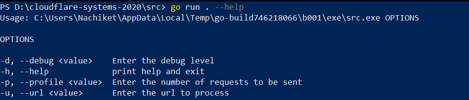
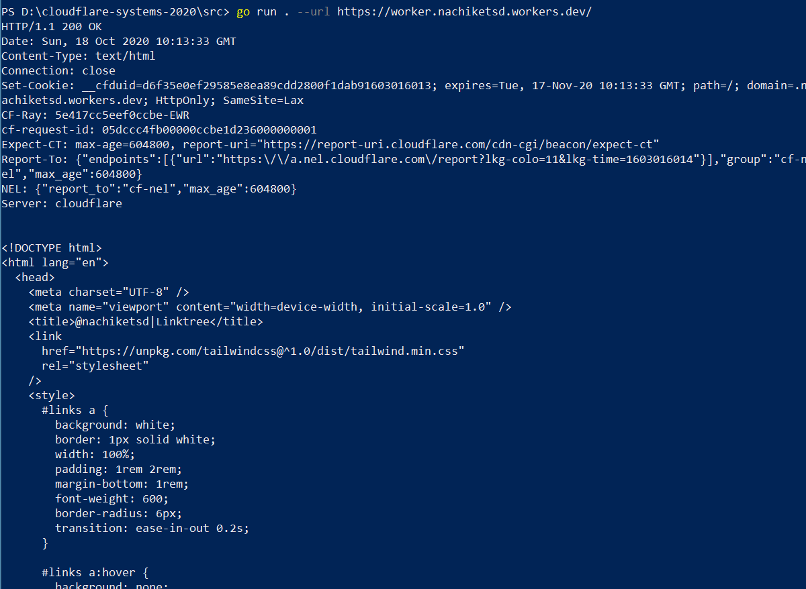
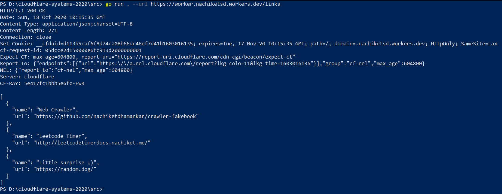
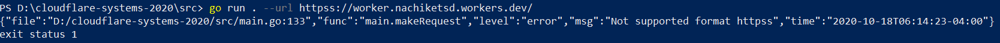
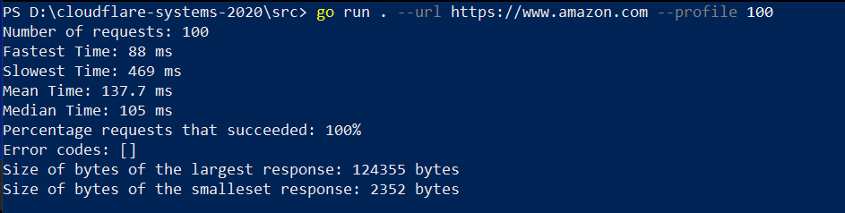
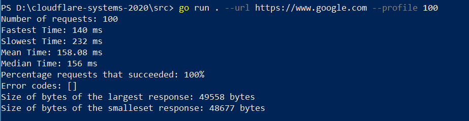
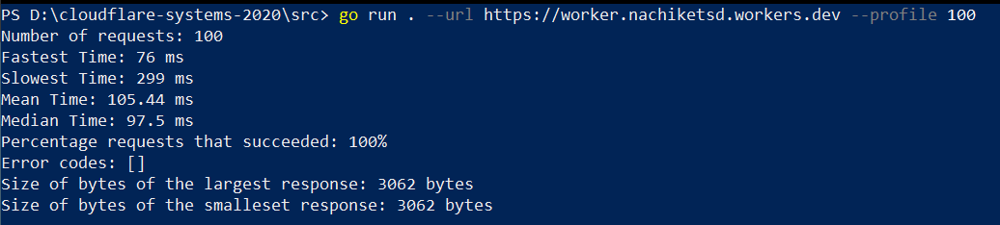
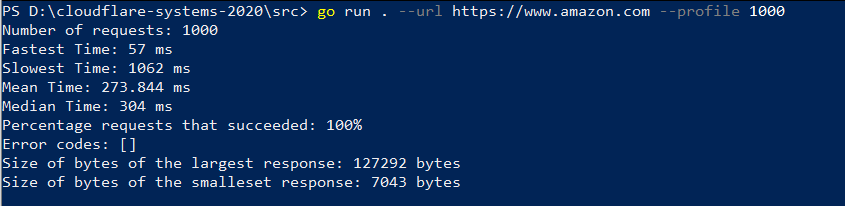
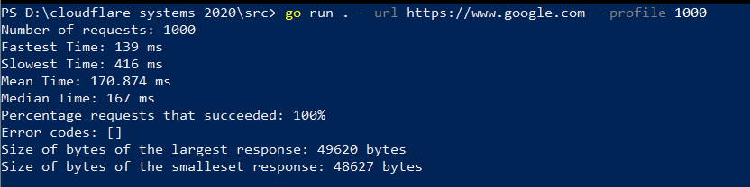
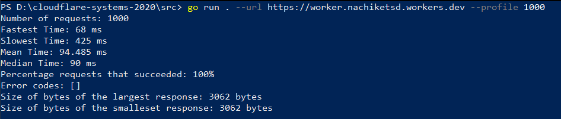

## Performance Metrics Calculator
This tool calculates the following metrics 
- Number of requests sent
- Fastest Response Time in ms
- Slowest Response Time in ms
- Mean Response Time
- Median Response Time
- The percentage of requests that succeeded
- Any error codes returned that weren't a success
- The size in bytes of the smallest response
- The size in bytes of the largest response

___
#### Usage
1. Install Go
2. Make sure the GOROOT and GOPATH are set correctly
3. Install the following packages (not sure if Go automatically downloads the libraries)
    - "github.com/galdor/go-cmdline"
    - "github.com/montanaflynn/stats"
    - "github.com/sirupsen/logrus"
4. cd into the repo
5. Commands
    - go run . --help
    - go run . --url {url}
    - go run . --url {url} --profile {Number of requests}

___
#### Working
- Definition of Response Time for this tool: The time taken to establish the connection to the server and receive the _all_ the data sent by the server. Hence, if the data sends a lot of data, the response time will increase.
- If there are no successful responses from the server, the *Fastest Response Time*, *Slowest Response Time*, *Mean Response Time*, *Median Response Time*, *Size of the smallest response*, *Size of the largest response* are for the responses with status codes other than OK (200). 
- The tool automatically reads the protocol from the URL and forms a socket connection with ssl.
- Currently supports only _http_ and _https_.
- The connection request times out after 7s.

___
#### Screenshots

___
#### Comparison
| Number of Requests 	| Amazon 	                                | Google 	                                  | Worker 	                                  |                                       
|--------------------	|--------	                                |--------	                                  |--------	                                  |                                       
|        100          	|    |      |    |                                        
|       1000         	|  |    |  |                                       
|                    	|        	                                |        	                                  |        	                                  |                                       

* For 100,
    - The worker has the *fastest time*: It served the client with a response in a whooping 76 ms. Amazon comes in 2nd with 88ms.
    - The worker is ~200ms faster than the slowest response time(from Amazon)
    - The *average Response time* for the worker is fastest and is ~30 ms faster than Amazon (who comes in 2nd)
    - The *median time* for worker is 97.5 ms. Which means there were 50 requests faster than 97.5ms. Amazon comes in a close second with a median time of 105ms.
    - Overall the worker serves faster than Amazon and Google. While Amazon performs well, there's a clear difference between Worker and Amazon. 
    
* For 1000,
    - Amazon has the *fastest time* for 1000 requests. While it has the largest byte size array, it takes the least time.
    - Amazon also has the slowest time. Since one of the responses was large, it must have taken more time. Ideally, plotting a graph would give more insight into the performance
    - Worker has the least mean time. Which means on an average the worker performs better.